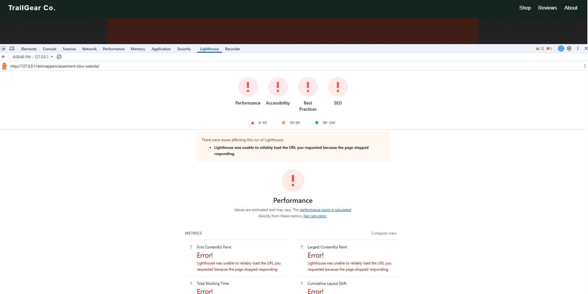
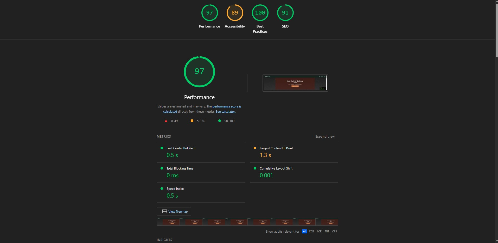

# Performance Optimization Report

## Overview

I analyzed the repository and fixed the identified performance issues.

Before implementing the changes, Lighthouse was unable to generate a complete report because the website performed poorly. Nearly all Lighthouse metrics were in the red.

After implementing the optimizations, the Lighthouse scores improved significantly:

| Metric         |   Score |
| -------------- | ------: |
| Performance    |  **97** |
| Accessibility  |  **89** |
| Best Practices | **100** |
| SEO            |  **93** |

## Lighthouse Reports

### Before Optimization



### After Optimization



---

# Summary of Fixes

### 1. Fixed unnecessary polyfill loading

Removed the always-true condition so the polyfill bundle is loaded only when `window.Promise` is unavailable, instead of being loaded in every browser.

### 2. Removed duplicate jQuery

Removed the duplicate jQuery library and its associated file from the repository.

### 3. Removed unused libraries

Removed the unused `moment.js` and `lodash.js` libraries, as they were not referenced anywhere in the website.

### 4. Removed unused font preload

Removed the font preload directive because the preloaded font was never used.

### 5. Removed unused font files

Removed unnecessary font files and retained only the fonts that are actually used by the website.

### 6. Added lazy loading for images

Implemented native lazy loading to defer loading off-screen images until they are needed.

### 7. Optimized images

Converted and compressed images to the WebP format to reduce file size and improve loading speed.

### 8. Removed duplicate asset

Removed the duplicate image file `texture-copy.webp`.

### 9. Removed unnecessary CSS import

Removed the unused CSS import:

```css
@import url('vendor-framework.css');
```

### 10. Removed duplicate jQuery script

Removed the duplicate jQuery file and its import from app.js

### 11. Fixed inefficient DOM updates

Replaced `innerHTML +=` inside a loop with a more efficient approach, resolving the continuous rendering and loading issue.

### 12. Fixed memory leak

Resolved an unbounded array growth issue that was causing a memory leak.

### 13. Removed unused resize listener

Removed the unused `resize` event listener, reducing unnecessary event handling.

### 14. Removed duplicate initialization

Removed a duplicate initialization call that was executing unnecessarily.

### 15. Removed unnecessary scroll handling

The purpose of increasing the height of a `div` during scrolling was unclear and appeared unnecessary.

As a result:

* Removed the unused `scroll` event listener.
* Removed the `equalizeCardHeights()` function, since it was only invoked by that event listener.

### 16. Made review loading asynchronous

Updated the review loading process to use asynchronous `fetch()`.

Also updated all functions that depended on `loadReviewsAsync()` to work asynchronously.

### 17. Fixed throttle condition

Updated the throttle condition to:

```javascript
now - last >= wait
```

This ensures the throttle behaves correctly.

### 18. Reduced localStorage writes

Increased the throttle interval to **5 seconds**, reducing the frequency of writes to `localStorage` and improving runtime performance.

### 19. Optimized IntersectionObserver usage

Created a single `IntersectionObserver` instance during page initialization instead of creating multiple observers.

This allows efficient tracking of elements throughout the page lifecycle. The unnecessary throttle was also removed, as observer initialization occurs only once during page load.

### 20. Cleared analytics buffer after sync

Added a function to clear `analyticsBuffer` after successfully synchronizing the analytics data, preventing unnecessary memory usage.

### 21. Improved modal cleanup

Reordered the modal cleanup process so that:

1. Pending data is saved.
2. The modal is removed from the DOM.
3. The modal reference is set to `null`.

This ensures proper cleanup and avoids stale references.

### 22. Improved refresh rate detection

Implemented a dedicated function to accurately determine the current screen refresh rate.

# Future Improvements

Apart from the improvements implemented in this task, there are a few additional areas where the project could be enhanced:

* **Replace the current particle system:** The existing particle implementation could be replaced with **particles.js** (or a similar modern particle library), which provides a wider variety of particle effects and offers greater flexibility for customization.

* **Improve the visual design:** The current color scheme could be updated with a more modern and cohesive color palette to enhance the overall user experience and visual appeal.

* **Use CDN-hosted libraries:** Instead of bundling libraries such as jQuery and polyfills with the project, they could be served through a CDN where appropriate. This can improve caching, reduce bandwidth usage, and potentially decrease page load times for returning users.

* **Migrate to a modern frontend framework:** Rebuilding the frontend using a modern framework such as React could address many of the architectural and maintainability issues identified in the project. It would also improve component reusability, state management, and long-term scalability.

These are some of the areas where the project can be further improved beyond the optimizations implemented in this report.
